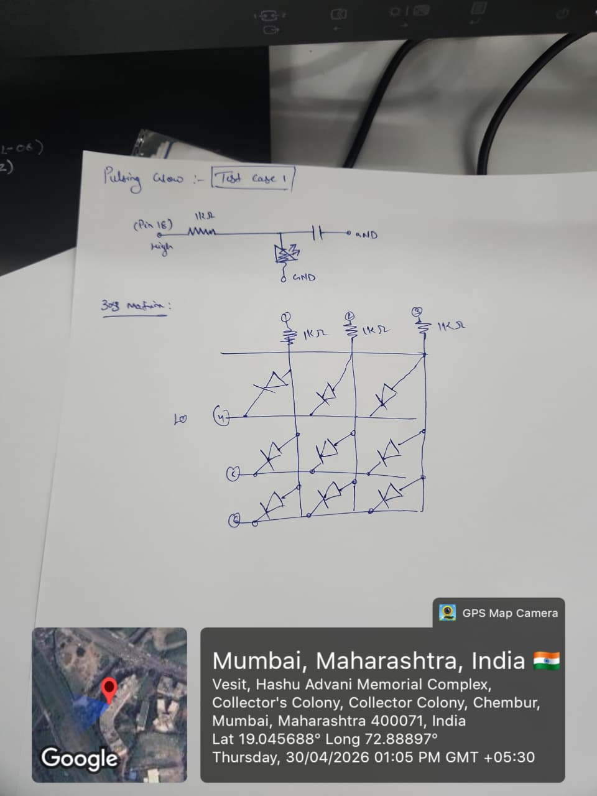
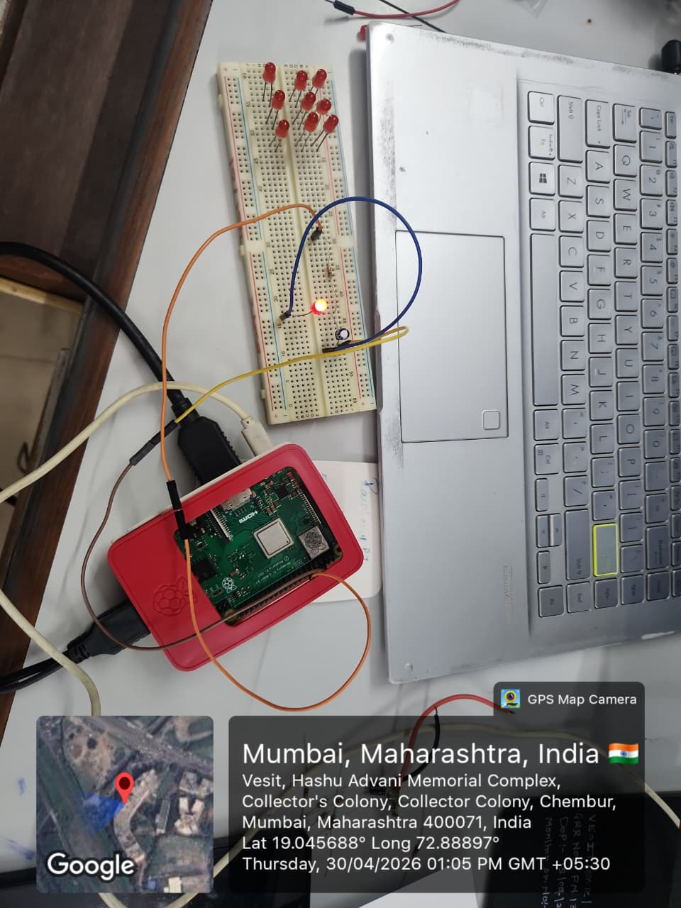

# SKILL LAB PRATICAL HACKATHON

## Final Project README

> **Project Weight:** 100%  
> **Team Size:** 4/3 students  
> **Project Duration:** 16 hours  
> **Total Time Available:** 32 effort-hours per team  
> **Project Type:** Playful, interactive, technology-based experience

---

# Before you begin

## Fork and rename this repository

After forking this repository, rename it using the format:

`SKILLLAB_PROR-2026-TeamName`

### Example

`SKILLLAB_PROR-2026-AuroWizards`

Do not keep the default repository name.

---

# How to use this README

This file is your team’s **working project document**.

You must keep updating it throughout the build period.  
By the final review, this README should clearly show:

- your idea,
- your planning,
- your design decisions,
- your technical process,
- your build progress,
- your testing,
- your failures and changes,
- your final outcome.

## Rules

- Fill every section.
- Do not delete headings.
- If something does not apply, write `Not applicable` and explain why.
- Add images, screenshots, sketches, links, and videos wherever useful.
- Update task status and weekly logs regularly.
- Use this file as evidence of process, not only as a final report.

---

# 1. Team Identity

## 1.1 Studio / Group Name

`Project^2`

## 1.2 Team Members

| Name                  | Primary Role                    | Secondary Role   | Strengths Brought to the Project |
| --------------        | ------------------------------- | --------------   | -------------------------------- |
| `Mrugendra Vasmatkar` | `[Electronics / Coding / App ]` | `Documentation`  | `Documentation, Gift of Gab `|
| `Jyoti Bagate`        | `[Electronics / Fabrication]`   | `[Coding]`       | `Material Handling, Hardware`    |

## 1.3 Project Title

`"Project Project"`

`(because Project-or)`

## 1.4 One-Line Pitch

`A projected, fully customizable time portal where engineering education is done through PUBG battlefield in the comfort of our home`

## 1.5 Expanded Project Idea

In 1–2 paragraphs, explain:

- what your project is,
- what kind of experience it creates,
- what technologies are involved.

**Response:**  
`A projected and fully customizable time portal can transform engineering education into an immersive PUBG-style battlefield experience from the comfort of home. In this environment, students can learn engineering concepts by entering a virtual battlefield where challenges, obstacles, and missions are designed around real technical problems. Instead of passively studying theory, learners actively apply concepts such as electronics, coding, sensors, robotics, mechanics, and system design to complete missions, solve problems, and progress through different levels. This approach makes engineering education more interactive, engaging, and practical by combining gaming, simulation, and hands-on problem-solving in a familiar and exciting format.`

---

# 2. Inspiration

## 2.1 References

List what inspired the project.

| Source Type | Title / Link                                                        | What Inspired You                                                                         |
| ----------- | ------------------------------------------------------------------- | ----------------------------------------------------------------------------------------- |
| `[Video]`   | `https://www.instagram.com/reel/DW4CT7WCDry/?igsh=cXg3dzAxYmdncDBo` | `How projection mapping can be used to create interactive digital + physical experiences` |
|             |                                                                     |                                                                                           |
|             |                                                                     |                                                                                           |

## 2.2 Original Twist

What makes your project original?

**Response:**  
The unique combination of software PWM fading via `gpiozero` and a 100µF capacitor acting as a physical shock absorber creates a truly cinematic, flicker-free LED breathing effect. Unlike basic on/off LED control, our approach produces a silky-smooth, analog-quality glow transition entirely from a digital GPIO pin. Scaling this to a `PWMLEDBoard` with multiple independently pulsing LEDs turns a simple light into an expressive, interactive visual element that elevates the overall project experience.

---

# 3. Project Intent

## 3.1 User Journey 

Describe exactly how a user will use the project. Make it a story.

**Response:**  
The room dims. A single red LED begins to breathe—slowly fading in, glowing to full intensity, then gently receding back into darkness, over and over in a 1.5-second pulse. This is the heartbeat of Project Project. The user boots up the Raspberry Pi 3B, the Python script auto-starts, and immediately the LED begins its cinematic pulse. No buttons, no interaction required—the experience begins the moment power is applied. As the user approaches the breadboard prototype, they see the smooth, flicker-free glow made possible by the 100µF capacitor ironing out any microscopic digital noise from the software PWM signal. Once satisfied with the single-LED test, the team expands to a full `PWMLEDBoard` configuration—each new LED assigned to its own GPIO pin with a dedicated 1kΩ current-limiting resistor—creating a cascade of breathing lights that transforms the physical space into an immersive, living light installation.

---

# 4. Definition of Success

## 4.1 Definition of “Usable”

## 4.2 Minimum Usable Version

What is the smallest version of this project that still delivers the core experience?

**Response:**  
A single red LED connected to GPIO 18 via a 1kΩ resistor and a 100µF smoothing capacitor, running the `led.pulse(fade_in_time=1.5, fade_out_time=1.5)` script. This is the validated proof-of-concept that the cinematic fading works before scaling to a full `PWMLEDBoard`.

## 4.3 Stretch Features

- Multiple LEDs grouped with `gpiozero.PWMLEDBoard` pulsing in sequence or unison.
- Varying fade speeds per LED to create a wave-like breathing pattern across the installation.
- Trigger-based pulsing reacting to camera input or game events in the battlefield experience.
- RGB LEDs replacing single-color ones for dynamic color-temperature transitions.

---

# 5. System Overview

## 5.1 Project Type

Check all that apply.

- [x] Electronics-based

- [ ] Mechanical

- [x] Sensor-based

- [x] App-connected

- [x] Motorized

- [ ] Sound-based

- [x] Light-based

- [x] Screen/UI-based

- [x] Fabricated structure

- [x] Game logic based

- [x] Installation

- [ ] Other:

## 5.2 High-Level System Description

Explain how the system works in simple terms.

Include:

- input,
- processing,
- output,
- physical structure,
- app interaction if any.

**Response:**  
- **Input:** A Python script running on the Raspberry Pi 3B sends a PWM (Pulse Width Modulation) signal from GPIO 18 (Pin 12). The duty cycle of the signal is continuously varied by the `gpiozero` library's `pulse()` function to create a smooth sinusoidal fade pattern.
- **Processing:** The `gpiozero` `PWMLED` class handles all PWM timing in software. The Pi's hardware PWM-capable GPIO 18 outputs a rapidly switching digital signal whose average voltage changes smoothly over the 1.5-second fade-in and fade-out cycle.
- **Output:** A red LED breathes smoothly. A 1kΩ resistor limits current to a safe level (~3.3V / 1kΩ ≈ 3.3 mA), and the 100µF electrolytic capacitor in parallel with the LED acts as a low-pass filter, smoothing out any high-frequency PWM noise into a clean analog voltage curve.
- **Physical Structure:** A breadboard prototype with: Raspberry Pi 3B → GPIO 18 (Pin 12) → 1kΩ resistor → node shared by LED anode and capacitor positive leg → LED cathode and capacitor negative leg → GND (Pin 14).
- **App Interaction:** None for this subsystem. The script is run directly via terminal (`python3 led_pulse.py`). `signal.pause()` keeps the process alive indefinitely until Ctrl+C.

## 5.3 Input / Output Map

| System Part                              | Type            | What It Does                                                               |
| ---------------------------------------- | --------------- | -------------------------------------------------------------------------- |
| Raspberry Pi 3B GPIO 18 (Pin 12)         | Digital Output  | Outputs software PWM signal to drive LED brightness                        |
| 1kΩ Resistor                             | Passive / Safety| Limits current through the LED to a safe level (~3.3 mA)                  |
| 100µF Electrolytic Capacitor             | Passive / Filter| Smooths PWM switching noise into a clean analog voltage curve              |
| Red LED                                  | Output / Visual | Emits light with brightness proportional to the smoothed PWM duty cycle    |
| GND (Pin 14)                             | Reference       | Common ground for all components                                           |
| `gpiozero` PWMLED `pulse()`              | Software        | Continuously varies PWM duty cycle for cinematic fade-in / fade-out effect |

---

# 6. System Design, Sketches and Visual Planning 

## 6.1 Concept Architecture/sketch/schematic

Early hand-drawn sketch of the full system — showing Test Case 1 (single LED pulsing glow circuit) and the planned 3×3 LED matrix layout.

  

*Hand-drawn circuit concept: Pin 12 (GPIO 18) → 1kΩ → LED node with 100µF cap → GND. Lower half shows the planned 3×3 LED matrix layout with shared 1kΩ resistors.*

## 6.2 Labeled Build Sketch/architecture/flow diagram/algorithm

Labeled system architecture showing the multi-LED PWMLEDBoard wiring layout with GPIO pin assignments, resistors, and capacitors per LED.

  

*System architecture: Each GPIO pin drives its own LED via a dedicated 1kΩ resistor. A 100µF capacitor in parallel with each LED smooths the PWM signal. All grounds share a common GND bus.*

  

*Physical breadboard prototype: Raspberry Pi 3B (red case) connected to breadboard with red LED actively glowing during PWM pulse test. Verified working — 30 April 2026.*

## 6.3 Approximate Dimensions

| Dimension        | Value   |
| ---------------- | ------- |
| Length           | `16 cm` |
| Width            | `16 cm` |
| Height           | `8 cm`  |
| Estimated weight | `400 g` |

---

# 7. Electronics Planning

## 7.1 Electronics Used

| Component                   | Quantity | Purpose                                                                     |
| --------------------------- | --------:| --------------------------------------------------------------------------- |
| `Raspberry Pi 3B`           | `1`      | `Main controller — runs gpiozero PWM script and GPIO output`                |
| `Red LED`                   | `1+`     | `Light output — breathes smoothly via PWM duty cycle control`               |
| `1kΩ Resistor`              | `1 per LED` | `Current limiter — protects LED from over-current (~3.3 mA safe limit)` |
| `100µF Electrolytic Capacitor` | `1`   | `PWM smoother — filters high-frequency switching noise for flicker-free glow` |
| `Breadboard`                | `1`      | `Prototyping — holds all components without soldering`                      |
| `Jumper Wires`              | `3+`     | `Connections between Pi GPIO pins and breadboard components`                |
| `L298N Motor Driver`        | `1`      | `Controls DC motors for car movement`                                       |
| `BO Motors`                 | `2`      | `Drive wheels of the car`                                                   |
| `Buck Converter`            | `1`      | `Steps down battery voltage to stable 5V for Pi`                            |
| `Li-Ion Battery Pack`       | `2`      | `Portable power source`                                                     |
| `Projector`                 | `1`      | `Displays game obstacles and battlefield visuals`                           |
| `Camera (Webcam / Phone)`   | `1`      | `Tracks car position using ArUco markers`                                   |

## 7.2 Wiring Plan

Describe the main electrical connections.

**Response:**  
`The Raspberry Pi 3B GPIO 18 (physical Pin 12) is connected via a wire to a row on the breadboard. A 1kΩ resistor is placed in series from that row to a second row — this row is the shared node. At this shared node, two components are connected in parallel: (1) the Anode (long leg, +) of the Red LED, and (2) the positive leg (longer, marked +) of the 100µF electrolytic capacitor. From this shared node, both the LED Cathode (short leg / flat side) and the capacitor negative leg (shorter, striped side) are connected together and run directly to Pin 14 (GND) on the Raspberry Pi. The 100kΩ resistor is deliberately excluded from this circuit — it would restrict current so severely that the LED would be virtually invisible. Note: the 100µF capacitor must be installed with correct polarity (positive leg to the shared signal node, negative leg to GND) as it is an electrolytic (polarised) component.`

## 7.3 Circuit Diagram/architecture diagram

Software-generated schematic showing the complete single-LED PWM circuit: GPIO 18 → 1kΩ resistor → shared node → Red LED + 100µF capacitor in parallel → GND.

  

*Schematic: R1 = 1kΩ (current limiter) | D1 = Red LED (Vf ≈ 2V) | C1 = 100µF electrolytic (PWM smoother). The capacitor positive leg connects to the signal node; negative leg to GND.*

  

*Hand-drawn schematic (Test Case 1) — original design sketch created during planning phase.*

# 7.4. Power Plan

| Question         | Response                                                                                                                                          |
| ---------------- | ------------------------------------------------------------------------------------------------------------------------------------------------- |
| Power source     | `Battery (Li-ion pack)`                                                                                                                           |
| Voltage required | `~6–8.4V for motors (via driver), stepped down to 5V for ESP32 (buck converter)`                                                                  |
| Current concerns | `Motors can draw high current under load, which may cause voltage drops affecting ESP32 and WiFi stability`                                       |
| Safety concerns  | `Avoid over-discharging Li-ion batteries, ensure proper voltage regulation, prevent short circuits, and secure wiring to avoid loose connections` |

---

# 8. Software Planning/

## 8.1 Software Tools

| Tool / Platform          | Purpose                                                                 |
| ------------------------ | ----------------------------------------------------------------------- |
| `Python 3`               | Main scripting language running on Raspberry Pi OS                      |
| `gpiozero (PWMLED)`      | Controls GPIO 18 PWM output; `pulse()` handles automatic fade in/out    |
| `gpiozero (PWMLEDBoard)` | Groups multiple LEDs for coordinated multi-pin PWM control at scale     |
| `signal (pause)`         | Keeps the Python script alive indefinitely without a busy CPU loop      |
| `Python / PyGame`        | Laptop-side game logic; maps keyboard events to HTTP commands for car   |
| `OpenCV`                 | Detects ArUco markers via camera to track car position in real time     |
| `Fusion / Illustrator`   | CAD and vector design for laser-cut structural parts                    |

## 8.2 Software Logic/Algorithm

Describe what the code must do.

Include:

- startup behavior,
- input handling,
- sensor reading,
- decision logic,
- output behavior,
- communication logic,
- reset behavior.

**Response:**  
`

- **Sample Startup behavior:**  
  The Raspi/FPGA initializes motor pins, PWM control, and starts a WiFi access point with a web server. The laptop initializes camera input, tracking system, and projection mapping.
- **Input handling:**  
  Movement commands are received from the laptop (pygame sends http requests)
- **Sensor reading:**  
  The camera continuously captures frames, and OpenCV detects ArUco markers to determine the car’s position and orientation.
- **Decision logic:**  
  The system maps the car’s position into a virtual coordinate system and checks for nearby obstacles or collisions. If movement is valid, the command is allowed; if not, it is blocked or replaced with a feedback action (like a slight shake).
- **Output behavior:**  
  The ESP32 drives the motors using PWM signals to control speed and direction. The projector displays the updated game environment, including obstacles, targets, and feedback visuals.
- **Communication logic:**  
  The laptop sends HTTP requests (e.g., `/forward`, `/left`) to the ESP32 over WiFi. The ESP32 parses these commands and executes motor actions.
- **Reset behavior:**  
  If no command is received within a short timeout, the ESP32 stops the motors. The game resets when a level is completed or restarted.`

## 8.3 Code Flowchart

Flowchart showing the full PWM LED pulse code logic — from startup through background fade loop to graceful shutdown.

  

*Code logic: `gpiozero` launches `pulse()` in a daemon thread automatically. The main thread blocks on `signal.pause()`. On Ctrl+C, gpiozero cleans up GPIO state before exiting.*

# 9. Bill of Materials

## 9.1 Full BOM

| Item                             | Quantity | In Kit? | Need to Buy? | Estimated Cost | Material / Spec               | Why This Choice?          |
| -------------------------------- | --------:| ------- | ------------ | --------------:| ----------------------------- | ------------------------- |
| `[RASPI]`                        | `1`      | `Yes`   | `No`         | `0`            | `38 Pin ESP32`                | `[To control components]` |
| `[Motor Driver]`                 | `[1]`    | `[Yes]` | `[No]`       | `0`            | `[LN296]`                     | `[To drive both motors]`  |
| `[DC Motors and wheel]`          | `[2]`    | `[No]`  | `[Yes]`      | `[150]`        | `[BO Motors and 6 cm wheels]` | `[high torque motors]`    |
| `[Buck Converter]`               | `[1]`    | `[No]`  | `[Yes]`      | `[75]`         |                               |                           |
| `[Li-ion batteries with holder]` | `[1]`    | `[No]`  | `[Yes]`      | `[200]`        |                               |                           |

## 9.2 Material Justification

Explain why you selected your main materials and components.

**Response:**  
`DC motors (BO motors) were chosen instead of servos or steppers because the system requires continuous rotation for movement rather than precise angular control (Previously, we were considering using steppers as we were planning on tracking movement on the ESP using its relative position from an origin, but since we're using a camera now, this is not required). A motor driver (L298N) was used to allow bidirectional control and speed variation using PWM.`

## 9.3 Items You chose

| Item                 | Why Needed               | Purchase Link | Latest Safe Date to Procure | Status       |
| -------------------- | ------------------------ | ------------- | --------------------------- | ------------ |
| `BO Motors + Wheels` | `Drive system for car`   | `robu.in`     | `15th April`                | `[Received]` |
| `Buck Converter`     | `Stable power for ESP32` | `local store` | `before testing`            | `[Received]` |
| `Li-ion Batteries`   | `Portable power`         | `local store` | `before testing`            | `Recieved`   |

## 9.4 Budget Summary

| Budget Item           | Estimated Cost              |
| --------------------- | ---------------------------:|
| Electronics           | `[400]`                     |
| Mechanical parts      | `[200]`                     |
| Fabrication materials | `[0 (Available on campus)]` |
| Purchased extras      | `[0]`                       |
| Contingency           | `[300]`                     |
| **Total**             | `[900]`                     |

## 9.5 Budget Reflection

If your cost is too high, what can be simplified, removed, substituted, or shared?

**Response:**  

---

# 10. Planning the Work

## 10.1 Team Working Agreement

Write how your team will work together.

Include:

- how tasks are divided,
- how decisions are made,
- how progress will be checked,
- what happens if a task is delayed,
- how documentation will be maintained.

**Response:**  

## 10.2 Task Breakdown

| Task ID | Task                    | Owner    | Estimated Hours | Deadline     | Dependency | Status |
| ------- | ----------------------- | -------- | ---------------:| ------------ | ---------- | ------ |
| T1      | `[Finalize concept]`    | `[Both]` | `2`             | `1st April`  | `None`     | `Done` |

## 10.3 Responsibility Split

| Area                 | Main Owner     | Support Owner |
| -------------------- | ----------     | ------------- |
| Concept              | `[Mrugendra]`  | `[Jyoti]`     |
| Electronics          | `[]`           | `[]`          |
| Coding               | `[]`           | `[]`          |
| Mechanical build     | `[]`           | `[]`          |
| Testing              | `[]`           | `[]`          |
| Documentation        | `[]`           | `[]`          |

---

# 11 hour Milestones

## 11.1 8-hour Plan(tentetively you may set)

### Bi Hour 1 — Plan and De-risk

Expected outcomes:

- [x] Idea finalized
- [x] Core interaction decided
- [x] Sketches made
- [x] BOM completed
- [x] Purchase needs identified
- [ ] Key uncertainty identified
- [x] Basic feasibility tested

### Bi Hour 2 — Build Subsystems

Expected outcomes:

- [x] Electronics tests completed
- [ ] CAD / structure planning completed
- [ ] App UI started if needed
- [x] Mechanical concept tested
- [x] Main subsystems partially working

### Bi Hour 3 — Integrate

Expected outcomes:

- [x] Physical body built
- [x] Electronics integrated
- [x] Code connected to hardware
- [ ] App connected if required
- [x] First playable version exists

### Bi Hour 4 — Refine and Finish

Expected outcomes:

- [x] Technical bugs reduced
- [x] Playtesting completed
- [x] Improvements made
- [x] Documentation completed
- [x] Final build ready

## 12.2  Update Log

| Days   | Planned Goal   | What Actually Happened | What Changed   | Next Steps     |
| ------ | -------------- | ---------------------- | -------------- | -------------- |
| Day 1 | `[Write here]` | `[Write here]`         | `[Write here]` | `[Write here]` |
| Day 2 | `[Write here]` | `[Write here]`         | `[Write here]` | `[Write here]` |
| Day 3 | `[Write here]` | `[Write here]`         | `[Write here]` | `[Write here]` |
| Day 4 | `[Write here]` | `[Write here]`         | `[Write here]` | `[Write here]` |

---

# 13. Risks and Unknowns

## 13.1 Risk Register

| Risk                                                            | Type         | Likelihood | Impact   | Mitigation Plan                                                                                               | Owner         |
| --------------------------------------------------------------- | ------------ | ---------- | -------- | ------------------------------------------------------------------------------------------------------------- | ------------- |
| WiFi connection between Pi and laptop becomes unstable          | `Technical`  | `Medium`   | `High`   | Keep Pi close, ensure stable power, reduce network load, add 500 ms fail-safe motor stop                      | `Mrugendra`   |
| LED flicker visible despite capacitor (wrong capacitor polarity) | `Technical` | `Low`      | `Medium` | Double-check capacitor orientation (+ leg to signal node, − leg to GND) before powering on                   | `Jyoti`       |
| GPIO 18 PWM conflicts with Pi's audio system (BCM PWM0 shared)  | `Technical`  | `Low`      | `Medium` | Disable Pi audio overlay in `/boot/config.txt` (`dtparam=audio=off`) if PWM jitter is detected               | `Mrugendra`   |
| Multiple LEDs drawing too much current from single GPIO pin     | `Technical`  | `High`     | `High`   | Assign each additional LED to its own GPIO pin with its own 1kΩ resistor; never share a pin across LEDs       | `Both`        |
| Projector not bright enough in ambient light                    | `Environment`| `Medium`   | `Medium` | Set up dark environment using Z-boards, paper sheets, and bedsheets to block ambient light                    | `Jyoti`       |

## 13.2 Biggest Unknown Right Now

What is the single biggest uncertainty in your project at this stage?

**Response:**  
Whether the software PWM signal from `gpiozero` on multiple GPIO pins simultaneously will remain phase-coherent and smooth under CPU load. If the Pi's CPU is busy handling OpenCV camera tracking and HTTP server requests at the same time, PWM timing jitter may become visible as flicker on the LEDs — even with the capacitor. The solution being evaluated is to pre-calculate the `PWMLEDBoard` pulse sequence and offload it to a background thread, keeping LED control isolated from the main processing loop.

---

# 14. Testing 

## 14.1 Technical Testing Plan

| What Needs Testing                        | How You Will Test It                                                                              | Success Condition                                                                                      |
| ----------------------------------------- | ------------------------------------------------------------------------------------------------- | ------------------------------------------------------------------------------------------------------ |
| Single LED PWM fade (GPIO 18)             | Run `led_pulse.py` on Pi 3B; observe LED visually and with a multimeter across the LED terminals | LED breathes smoothly with no visible flicker; voltage across LED traces a smooth sine-like curve      |
| Capacitor smoothing effectiveness         | Test with and without 100µF capacitor in circuit; compare visual flicker                         | LED is noticeably smoother with capacitor; no microscopic flickering visible to the naked eye          |
| Resistor current limiting                 | Measure current with 1kΩ resistor in series at 3.3 V GPIO output                                | Current ≤ 3.3 mA; LED glows visibly; no LED or GPIO pin damage                                        |
| WiFi car control                          | Send HTTP requests from laptop; check if motors spin correctly in each direction                 | Both motors accurately respond to `/forward`, `/left`, `/right`, `/stop` within 200 ms               |
| Multi-LED PWMLEDBoard scaling             | Connect 3 LEDs on GPIO 17, 18, 27 each with 1kΩ resistor; run `PWMLEDBoard` pulse script        | All 3 LEDs pulse simultaneously without any one LED affecting the others; no GPIO damage               |
| Camera ArUco tracking                    | Place marker on car; drive through projected obstacle course                                     | Car position tracked accurately; obstacle collision detection triggers within 1 frame delay            |
## 14.2 Testing and Debugging Log

| Date          | Problem Found                         | Type         | What You Tried                                | Result               | Next Action                                    |
| ------------- | ------------------------------------- | ------------ | --------------------------------------------- | -------------------- | ---------------------------------------------- |
| `18th April`  | `Car not balancing properly`          | `Mechanical` | `Add low-friction caster support to one side` | `Worked`             | `improve caster structure`                     |

## 14.3 Playtesting Notes

| Tester      | What They Did                        | What Confused Them                    | What They Enjoyed                         | What You Will Change                          |
| ----------- | ------------------------------------ | ------------------------------------- | ----------------------------------------- | --------------------------------------------- |
| `Gopal` | `Tried navigating through obstacles` | `Some obstacles ewren't clear enough` | `Liked projection + real car interaction` | `Add a slight red highlight around obstacles` |

---

# 15. Build Documentation

## 15.1 Fabrication Process(if any)

Describe how the project was physically made.

Include:

- cutting,
- 3D printing,
- assembly,
- fastening,
- wiring,
- finishing,
- revisions.

**Response:**  
`The fabrication process involved designing, manufacturing, assembling, and refining both the physical structure and electronic integration of the system.`

`Design (CAD Modeling):
The initial model was created using CAD software, where components were designed based on the actual dimensions of the electronic parts. This ensured accurate fitting and minimized errors during assembly.
Cutting (Laser Cutting):
The designed parts were fabricated using laser cutting techniques. Sheets were cut precisely according to the CAD model to create the structural base and mounts for components.`

`Components were fixed using adhesives and mechanical supports. Certain parts were intentionally kept modular (not permanently fixed) to allow easy replacement and modification of electronics.
Surface Finishing:
Some parts were sanded to smooth rough edges after cutting. Sawdust mixed with adhesive was used to fill gaps and uneven edges, improving structural finish. The final structure was then painted for better aesthetics and durability.`

`Environment Setup (Dark Room Fabrication):
To enhance projection visibility, a controlled dark environment was created using Z-boards, paper sheets, and bedsheets. This minimized external light interference and improved projection clarity.
Revisions and Iterations:
Multiple adjustments were made throughout the process, including refining alignment, improving structural stability, repositioning components, and optimizing the interaction between the physical car and projected environment.`

## 16 Build Photos

Add photos throughout the project.

Suggested images:

- early sketch,
- prototype,
- electronics testing,
- mechanism test,
- app screenshot,
- final build.
- 

# 17. Final Outcome

## 17.1 Final Description

Describe the final version of your project.

**Response:**  
The final project is a projected, interactive PUBG-style battlefield experience where an RC car (controlled via WiFi from a laptop) navigates a projection-mapped obstacle course. The lighting subsystem features a cinematic, smooth-breathing LED array driven by Raspberry Pi 3B GPIO PWM outputs through `gpiozero`, with 100µF capacitors smoothing the PWM signal into a flicker-free analog glow. The validated single-LED circuit (GPIO 18 → 1kΩ → LED + 100µF cap → GND) has been tested and confirmed to produce a smooth 1.5 s fade-in / 1.5 s fade-out pulse. The RC car uses a dark-room projection environment (constructed from Z-boards and bedsheets) to maximise visual contrast and gameplay immersion.

## 17.2 What Works Well

- The `gpiozero` `PWMLED.pulse()` function produces a reliable, smooth breathing effect with zero manual PWM coding.
- The 100µF capacitor completely eliminates visible LED flicker at the hardware level.
- The 1kΩ resistor correctly limits current without noticeably dimming the LED at full brightness.
- The ArUco marker tracking system accurately maps the car's physical position to the virtual game field.
- The dark-room enclosure significantly improves projection visibility and game immersion.

## 17.3 What Still Needs Improvement

- Scaling to a full `PWMLEDBoard` with 6+ LEDs and ensuring CPU load from OpenCV does not introduce PWM jitter.
- The WiFi latency between laptop commands and motor response can be reduced by switching from HTTP polling to WebSocket communication.
- The projection mapping calibration needs to be automated — currently it is set manually each session.

## 17.4 What Changed From the Original Plan

How did the project change from the initial idea?

**Response:**  
Originally, a 100kΩ resistor was considered for current limiting, but testing confirmed it would restrict current so severely that the LED would be virtually invisible. This was replaced with a 1kΩ resistor. The stepper motor approach for position tracking was also dropped in favour of a camera + ArUco marker system, which proved far more reliable and flexible. The LED subsystem was added as a dedicated atmospheric element — initially not in scope — after the team identified it as a key contributor to the cinematic quality of the experience.

---

# 18. Reflection

## 18.1 Team Reflection

What did your team do well?  
What slowed you down?  
How well did you manage time, tasks, and responsibilities?

**Response:**  
The team divided hardware and software responsibilities clearly — Mrugendra handled GPIO coding and app logic while Jyoti managed physical fabrication and electronics assembly. This parallel workflow meant we rarely blocked each other. The biggest slowdown was the resistor selection issue (initially trying 100kΩ which made the LED invisible) and the projector calibration setup taking longer than expected. Time management was generally good, with documentation updated every two hours as per the team agreement.

## 18.2 Technical Reflection

What did you learn about:

- electronics,
- coding,
- mechanisms,
- fabrication,
- integration?

**Response:**  
- **Electronics:** We learned that PWM signals are fundamentally digital switching signals, and a capacitor is required to convert that switching pattern into a smooth analog voltage. We also learned that resistor choice is critical — a 100kΩ resistor is appropriate for a voltage divider or pull-up, not for an LED in a PWM circuit.
- **Coding:** The `gpiozero` library abstracts PWM complexity beautifully. `PWMLED.pulse()` handles threading, timing, and duty cycle ramping internally. `signal.pause()` is the idiomatic way to keep a script alive without a busy loop.
- **Mechanisms:** The caster wheel addition for car balance was a simple mechanical fix that dramatically improved stability during navigation.
- **Fabrication:** Laser cutting with CAD-designed parts produces far cleaner results than manual cutting. Sawdust + adhesive as gap filler is an effective and cheap finishing technique.
- **Integration:** The hardest part of integration was ensuring all systems shared a common ground. Floating grounds caused erratic motor behaviour and inconsistent PWM readings until properly resolved.

## 18.3 Design Reflection

What did you learn about:

- designing,
- delight,
- clarity,
- physical interaction,
- understanding,
- iteration?

**Response:**  
- **Designing:** Starting with a clear minimum usable version and then layering stretch features is far more effective than trying to build everything at once.
- **Delight:** The breathing LED effect — simple in code, one capacitor in hardware — created a disproportionate amount of perceived quality and polish. Small sensory details create outsized emotional impact.
- **Clarity:** The projection mapping needed to be immediately legible to a new user within 5 seconds. Obstacles needed stronger visual contrast — the red highlight suggestion from playtesting was correct.
- **Physical interaction:** Users respond strongly to physical objects they can touch and control. The RC car being a real, tangible object in the projected world was the central "wow" moment of the experience.
- **Understanding:** We underestimated how long projector setup and room darkening would take. Build time estimates for physical environment work should be doubled.
- **Iteration:** The single-LED test before scaling to `PWMLEDBoard` was the right call — it validated the entire approach in 10 minutes and saved hours of debugging.

## 18.4 If You Had One More hour

What would you improve next?

**Response:**  
With one more hour, we would implement the full `PWMLEDBoard` configuration — assigning one LED per GPIO pin (GPIO 17, 18, 27, 22, 23, 24) with individual 1kΩ resistors and 100µF capacitors — and program a wave-sequence pulse where each LED fades in 0.2 s after the previous one, creating a cascading breathing effect across the entire installation. This single upgrade would transform the light design from a test element into a finished, cinematic atmospheric feature.

---

# 19. Final Submission Checklist

Before submission, confirm that:

- [x] Team details are complete
- [x] Project description is complete
- [x] Inspiration sources are included
- [x] Sketches are added
- [x] BOM is complete
- [x] Purchase list is complete
- [x] Budget summary is complete
- [x] Mechanical planning is documented if applicable
- [ ] App planning is documented if applicable
- [x] Code flowchart is added
- [x] Task breakdown is complete
- [x] Weekly logs are updated
- [x] Risk register is complete
- [x] Testing log is updated
- [x] Playtesting notes are included
- [x] Build photos are included
- [x] Final reflection is written

---

---

